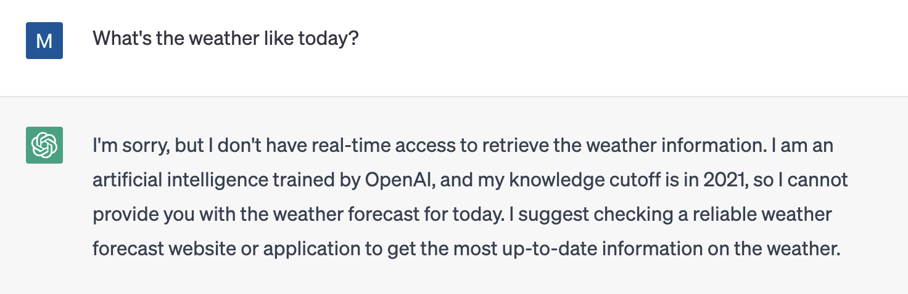

# Conversational UX issues

## Users have too much freedom

Conversational UX has been around for a while now, but I feel that there is still a gap in the amount and range of usage by users. While there are people who are using it well, I think there are quite a few people who don't know how to use it. This is a difficult problem to solve due to the nature of conversational UX.

As mentioned earlier, the input for conversational UX is natural language, so it is conceivable that people will be at a loss, not knowing what they can and cannot do.

## Potential to disappoint users

Given the nature of conversational UX, these applications are always next to the possibility that users will leave with a "what the heck can't I do this? For example, we often see this happen even with ChatGPT. For example, asking for the current weather or information about an acquaintance may result in a response that is not what you expect.

