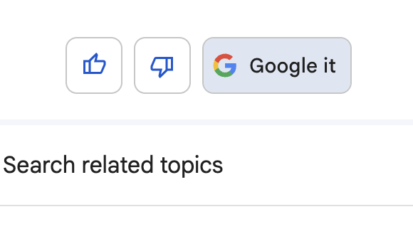

# Fallback

It is quite difficult to guess user input patterns, so if the application cannot handle them, it is necessary to fallback to another application or process.

Here are some examples of fallback:

## Redirecting to another application

Here is an example of ChatGPT. Here, we only provide a message for redirection rather than fully transferring the function.

```
Q: What is the weather today?
A: I cannot provide real-time weather information, but I recommend checking weather forecast websites or apps, or searching "today's weather" on a search engine to get the latest information.
```

## Displaying the results of an existing process

In the case of Google Bard, for example, Google search results are displayed after the assistant's message.

This combines the results of a process other than the existing LLM to assist the assistant's role.



Whether to display the results of an existing process without waiting for the user's judgment depends on the situation. While it eliminates the possibility of users leaving while waiting for their judgment, some users may find the results of the fallback annoying.
