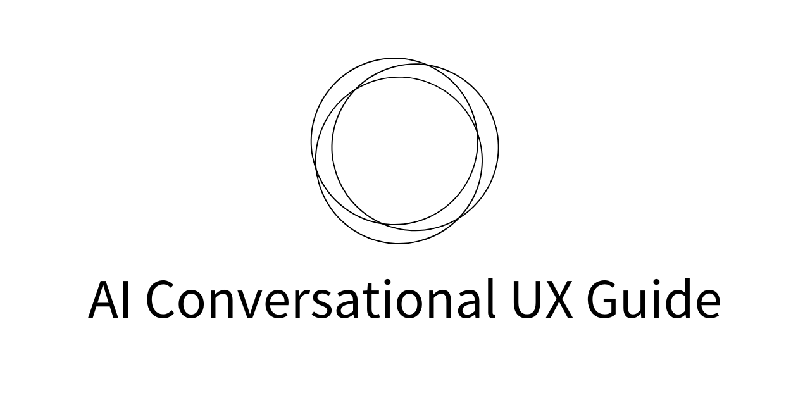

# AI UX Guide

言語モデルを利用したアプリケーションの普及により、アプリケーション開発者は、未知なる会話型 UX について考えることになりました。
このガイドでは、言語モデルのアプリケーション上での振る舞いの特性と会話型 UX を設計する際の指針についてまとめています。

## 会話型 UX とは？

### 概要

言語モデルをアプリケーションに組み込んだ際に、アプリケーションのインターフェースは、自然言語となります。
これが、ユーザーはアプリケーションと会話するように見えることから会話型 UX という言葉を利用しています。

このような UX を最初に普及させたのは OpenAI です。彼らは、ChatGPT という大言語モデルをリリースしました。
これは、特に会話型 AI としての性能を重視してチューニングされていおり、質問応答、文書生成、要約作成など、多様なタスクをこなすことができます。

### メッセージ

会話型 UX では、ユーザーとユーザーの指示を受けるアシスタント、そして、会話の前提を定義するシステムが存在しています。

会話は、メッセージによって構成されます。

### プロンプト

また、ユーザーからアシスタントへのメッセージはプロンプトと呼ばれることが一般的です。

例えば、質問応答のシナリオでは、プロンプトは質問となります。「東京の人口はどのくらいですか？」というプロンプトに対して、AI モデルは関連する情報を基にした回答を生成します。プロンプトは、モデルの出力品質や関連性に大きな影響を与えるため、効果的なプロンプトの作成が重要です。

### 自然言語による操作

言語モデルが自然言語を扱うモデルであることに由来し、メッセージは自然言語によって構成されます。その結果、会話型 UX を採用したアプリケーションでは、ユーザーは自然言語で操作を実行することになります。

## 📃 Blogs

- [Behind-the-Design: Meet Copilot. When the system is the product; on… | by Microsoft Design | Microsoft Design | Apr, 2023 | Medium](https://medium.com/microsoft-design/behind-the-design-meet-copilot-2c68182a0e70)
- [The 7 most important UX KPIs and how to measure them - TestingTime](https://www.testingtime.com/en/blog/important-ux-kpis/)

## 💻 Applications

- [ChatGPT](https://openai.com/blog/chatgpt)
- [Bing AI](https://www.microsoft.com/ja-jp/bing?form=MA13FJ)
- [Notion AI](https://www.notion.so/ja-jp/product/ai)
- [Microsoft 365 Copilot](https://blogs.windows.com/japan/2023/03/28/introducing-microsoft-365-copilot-a-whole-new-way-to-work/)
- [STUDIO AI | The new age design tool with WebDesignAI inside.](https://studio.design/?ref=producthunt)
- [Merchat AI [Beta] | Mercari](https://www.mercari.com/merchat/)

## 🤝 Contributing

Feel free to open a PR if you think something is missing here. Always welcome feedback and suggestions. Just open an issue!

## License

[MIT License](/LICENSE.md)
